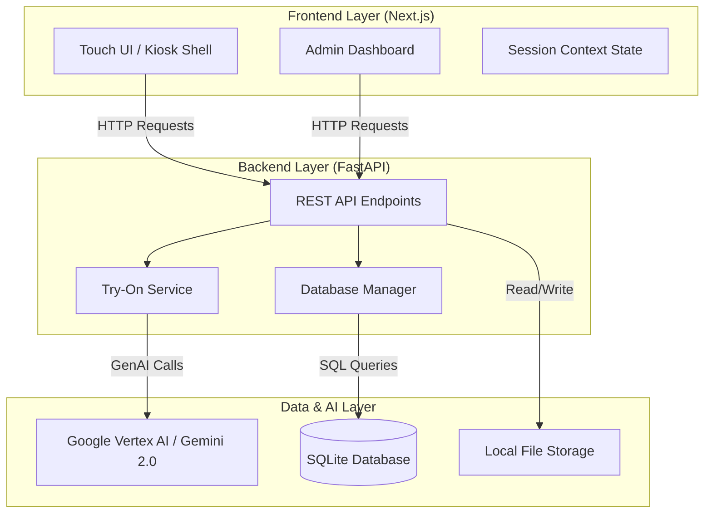

# VIRTUAL TRY-ON KIOSK: PROJECT REPORT
**A Next-Generation Smart Retail Solution**

---

## 1. EXECUTIVE SUMMARY

The **Virtual Try-On Kiosk** is an interactive, AI-powered smart mirror application designed to revolutionize the in-store retail experience. By leveraging the power of Generative AI (Google Gemini 2.0) and computer vision, the system allows customers to physically interact with a digital inventory and virtually "try on" clothes without entering a fitting room.

The system addresses key retail challenges such as fitting room congestion, inventory accessibility, and user engagement. Key features include a touch-first portrait interface, real-time AI-based image synthesis for try-on, privacy-preserving session management, and a comprehensive admin portal for inventory control.

This report details the system's design, architecture, implementation, and deployment strategies.

---

## 2. INTRODUCTION

### 2.1 Background
Traditional retail faces stiff competition from e-commerce. To stay relevant, physical stores must offer unique, experiential value. "Smart Mirrors" or virtual try-on kiosks bridge the gap between digital convenience and physical shopping, offering customers a fun and efficient way to explore products.

### 2.2 Objectives
*   **Enhance Customer Experience**: Provide a seamless, fun, and futuristic way to shop.
*   **Reduce Friction**: Eliminate the need to physically change clothes for every item.
*   **Privacy First**: Ensure user data (photos) is strictly session-based and auto-wiped.
*   **Operational Efficiency**: Provide staff with an easy tool to manage what's on display.

### 2.3 Scope
*   **Kiosk Application**: Public-facing interface for customers (Welcome -> Capture -> Discovery -> Try-On).
*   **Admin Portal**: Secure interface for store managers to manage the clothing catalog.
*   **Backend API**: Centralized server handling AI requests, database operations, and file storage.

---

## 3. SYSTEM ANALYSIS

### 3.1 Functional Requirements
1.  **User Session**: The system must track a user's session and automatically reset after inactivity.
2.  **Image Capture**: Users can take a photo using the built-in camera or upload one.
3.  **Clothing Discovery**: Users can browse clothes by Category, Occasion, and Style.
4.  **Virtual Try-On**: The system uses AI to realistically overlay the selected garment onto the user's photo.
5.  **Inventory Management**: Admins can CRUD (Create, Read, Update, Delete) clothing items.

### 3.2 Non-Functional Requirements
*   **Performance**: Try-on generation should initiate quickly and provide feedback (loading state).
*   **Privacy**: No user photos are stored permanently. Storage is cleared post-session.
*   **Usability**: UI must be optimized for 4K Portrait Touchscreens (large buttons, high contrast).
*   **Reliability**: The system must handle AI service failures gracefully.

### 3.3 Hardware Requirements
*   **Display**: 4K Portrait Touchscreen Monitor.
*   **Camera**: High-resolution Webcam (Logitech Brio or similar) mounted at eye level.
*   **Compute Unit**: Mini PC or Desktop (Windows/Linux) with moderate GPU/CPU capabilities.
*   **Network**: Stable Internet connection for cloud AI processing.

---

## 4. SYSTEM DESIGN

### 4.1 System Architecture



### 4.2 Database Design
The system uses **SQLite** for simplicity and portability, managed via **SQLAlchemy** (ORM).

**Table: `clothing_items`**
| Field | Type | Description |
|-------|------|-------------|
| `id` | UUID | Unique Identifier |
| `name` | String | Name of the garment |
| `category` | String | Scheduler (Shirt, Pant, Dress) |
| `occasion` | String | (Casual, Formal, Party) |
| `style` | String | (Modern, Classic, Boho) |
| `garment_image` | String | Path to high-res flat lay image for AI |
| `preview_image` | String | Path to display image for UI |
| `price` | String | Price string |

### 4.3 Tech Stack Selection
*   **Frontend**: `Next.js 16` (React) - Chosen for its robustness, routing, and easy deployment.
*   **Styling**: `Tailwind CSS` - For rapid, responsive, and consistent styling suitable for kiosk layouts.
*   **Backend**: `FastAPI` (Python) - High performance, native async support for AI calls, and easy integration with AI libraries.
*   **AI Engine**: `Google Gemini 2.0` - Selected for superior multimodal capabilities (understanding garment draping and body pose) compared to traditional GANs.

---

## 5. IMPLEMENTATION DETAILS

### 5.1 Frontend Implementation
The frontend is built as a Single Page Application (SPA) structure within Next.js.
*   **`session-context.tsx`**: The "brain" of the kiosk. It manages the global state:
    *   `currentScreen`: Controls the navigation flow (Welcome -> Camera -> TryOn).
    *   `sessionData`: Holds the user's photo and selected outfit.
    *   **Auto-Reset**: Implements `setTimeout` logic to reset the kiosk to the "Welcome" screen after 2 minutes of inactivity, ensuring privacy.
*   **Kiosk Shell**: A layout wrapper that enforces the 100vh/100vw bounds and prevents scrolling, mimicking a native app.

### 5.2 Backend Services
*   **`tryon_service.py`**: A specialized service class that handles communication with Google's AI.
    *   **Prompt Engineering**: Uses a sophisticated prompt that instructs the AI to:
        1.  Analyze garment type (Sleeve info, neckline).
        2.  Preserve user identity (Face, Hair, Skin tone).
        3.  Apply realistic lighting and fabric physics.
*   **API Routes**:
    *   `POST /api/try-on/generate`: Accepts user image + garment ID, returns generated image.
    *   `GET /api/clothing`: Returns filtered list of inventory.

### 5.3 AI Integration Strategy
Instead of training a custom model (which is resource-intensive), this project utilizes **In-Context Learning** with a Large Multimodal Model. We pass the person's image and the garment image to Gemini 2.0 Flash with strict instructions on "image synthesis" rather than just description. This allows for zero-shot virtual try-on without training on thousands of fashion datasets.

---

## 6. TESTING & VALIDATION

### 6.1 Testing Levels
1.  **Unit Testing**: Verified API endpoints using Swagger UI (`/docs`) to ensure correct JSON responses.
2.  **Integration Testing**: Tested the flow from Frontend Capture -> Backend Upload -> AI Generation -> Frontend Display.
3.  **User Acceptance Testing (UAT)**: Validated the "Session Timeout" feature by leaving the kiosk idle and confirming it resets to the Welcome screen.

### 6.2 Known Limitations
*   **AI Latency**: Generation can take 5-10 seconds depending on cloud load.
*   **Complex Poses**: Extreme poses (hands covering body) might sometimes confuse the AI generation.

---

## 7. USER MANUAL

### 7.1 Installation
1.  **Backend**:
    ```bash
    cd backend
    pip install -r requirements.txt
    # Set GOOGLE_API_KEY in .env
    python main.py
    ```
2.  **Frontend**:
    ```bash
    npm install
    npm run dev
    # Open http://localhost:3000
    ```

### 7.2 Usage
1.  **Start**: Tap "Touch to Start".
2.  **Capture**: Stand in the frame and tap the camera icon.
3.  **Shop**: Select usage occasion (e.g., "Party") to filter clothes.
4.  **Try-On**: Tap any clothing item to see it on yourself instantly.
5.  **Finish**: Tap "Done" to clear your data.

---

## 8. CONCLUSION & FUTURE SCOPE

The **Virtual Try-On Kiosk** successfully demonstrates the potential of GenAI in retail. It provides a hygienic, efficient, and engaging alternative to physical fitting rooms.

**Future Enhancements**:
*   **QR Code Handoff**: Allow users to scan a QR code to save their try-on result to their phone.
*   **Voice Control**: "Show me red dresses" for hands-free navigation.
*   **3D Avatar Generation**: Create a rotatable 3D model of the user for 360-degree fit checks.

---
*Report Generated: 2024*
