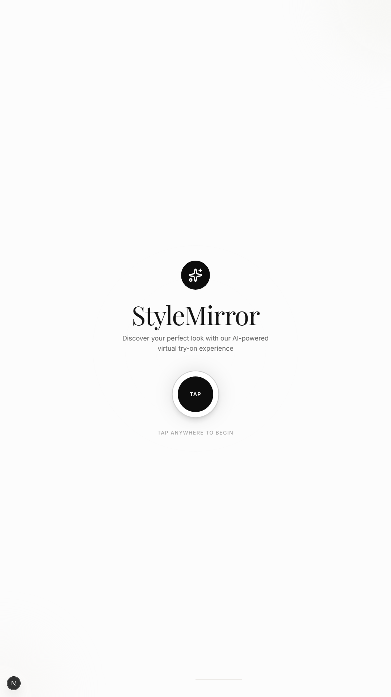
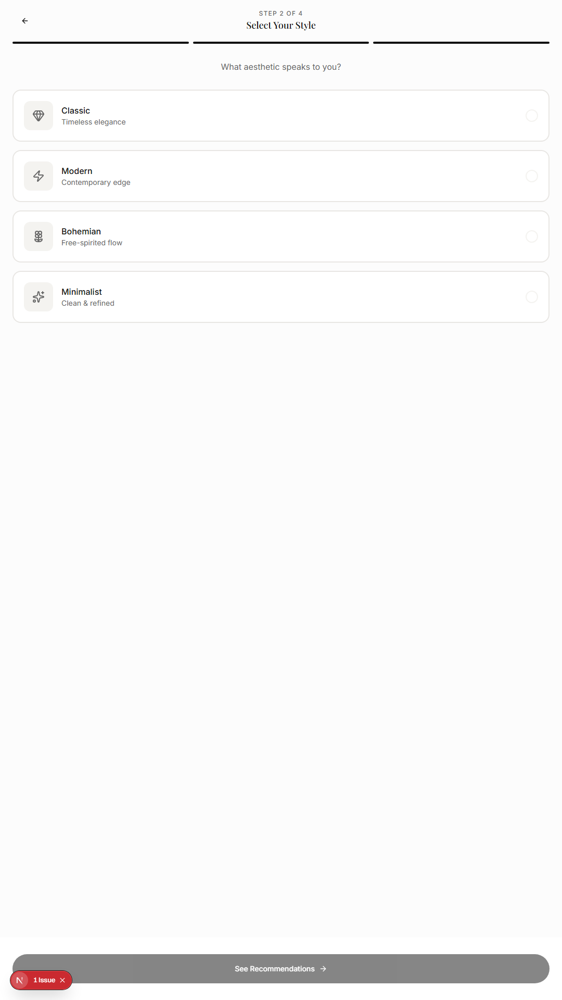
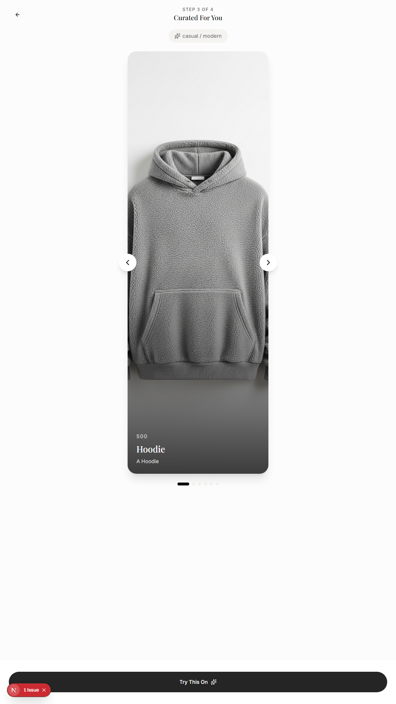
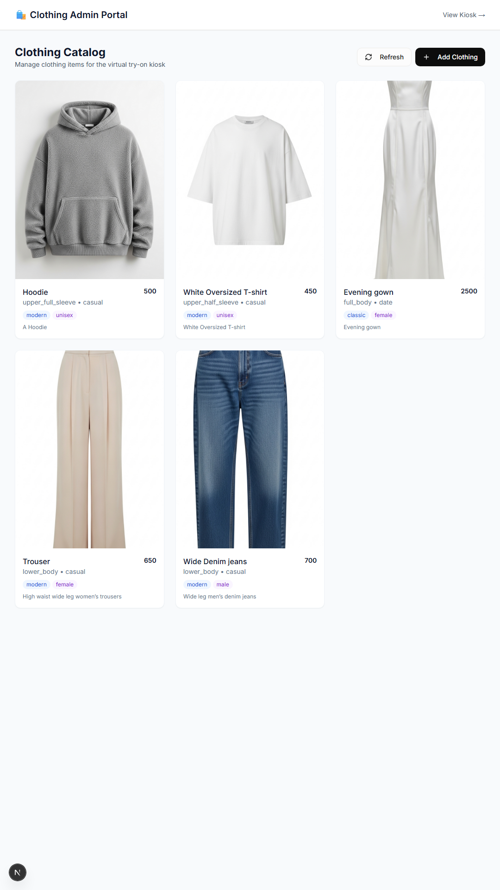

# Virtual Try-On Kiosk Application

## 📌 Project Overview
The **Virtual Try-On Kiosk** is a next-generation smart mirror application designed for retail environments. It allows users to virtually try on clothing using advanced AI technology. The application features a touch-first interface optimized for portrait displays, a robust admin panel for inventory management, and a privacy-focused session system.

## ✨ Key Features

### 🖥️ Frontend (Kiosk Interface)
- **Touch-Optimized UI**: Designed for vertical (portrait) 4K touchscreens.
- **Session Management**: Automatic session timeout and data wiping for user privacy.
- **AI Recommendations**: Suggests clothing based on user preferences (Occasion, Style).
- **Virtual Try-On**: Real-time visualization of selected garments on the user's photo.
- **Camera Integration**: Built-in camera capture with countdown and review.
- **Interactive Flow**:
  1.  **Welcome Screen**: Attract loop with start button.
  2.  **Capture**: Take a photo or upload.
  3.  **Preferences**: Select occasion (Casual, Formal, etc.) and style.
  4.  **Recommendations**: View AI-curated outfit suggestions.
  5.  **Try-On**: View the virtual try-on result.
  6.  **Exit**: Session summary and cleanup.

### 🛠️ Admin Portal
- **Dashboard**: Overview of system status.
- **Inventory Management**: Add, edit, and delete clothing items.
- **Image Upload**: Upload garment images for the try-on model.
- ** categorization**: Organize items by category, style, and occasion.

### 🚀 Backend
- **FastAPI**: High-performance Python backend.
- **AI Integration**: Powered by Google GenAI for recommendations and try-on synthesis.
- **Database**: SQLite with SQLAlchemy for reliable data storage.
- **Storage**: Local file storage for images (configurable).

## 📸 Snapshots

### Landing Page


### Preferences Selection


### Outfit Catalog


### Final Try-On Result


### Admin Panel


## 🏗️ Tech Stack

### Frontend
- **Framework**: [Next.js 16](https://nextjs.org/) (App Router)
- **Language**: [TypeScript](https://www.typescriptlang.org/)
- **Styling**: [Tailwind CSS](https://tailwindcss.com/) with `tailwindcss-animate`
- **UI Components**: [Shadcn/ui](https://ui.shadcn.com/) (Radix UI primitives)
- **Icons**: [Lucide React](https://lucide.dev/)
- **State Management**: React Context (`SessionContext`)
- **Forms**: `react-hook-form` with `zod` validation

### Backend
- **Framework**: [FastAPI](https://fastapi.tiangolo.com/)
- **Language**: Python 3.10+
- **Database**: SQLite (via `aiosqlite`)
- **ORM**: SQLAlchemy
- **AI/ML**: Google GenAI SDK
- **Task Runner**: Uvicorn

## 📂 Project Structure

```
kiosk-app-build/
├── app/                    # Next.js App Router
│   ├── admin/              # Admin Portal routes
│   ├── globals.css         # Global styles & Tailwind
│   ├── layout.tsx          # Root layout
│   └── page.tsx            # Home/Welcome page
├── backend/                # FastAPI Backend
│   ├── database/           # DB connection & models
│   ├── routes/             # API endpoints (tryon, clothing)
│   ├── services/           # Business logic
│   ├── storage/            # Image storage
│   ├── main.py             # App entry point
│   └── requirements.txt    # Python dependencies
├── components/             # React Components
│   ├── admin/              # Admin-specific components
│   ├── screens/            # Kiosk flow screens (Welcome, TryOn, etc.)
│   ├── ui/                 # Reusable UI components (Shadcn)
│   └── kisk-shell.tsx      # Main wrapper for Kiosk UI
├── lib/                    # Utilities & Context
│   └── session-context.tsx # Session state management
└── public/                 # Static assets
```

## 🚀 Getting Started

### Prerequisites
- **Node.js**: v18 or higher
- **Python**: v3.10 or higher
- **pnpm** (recommended) or npm

### 1. Frontend Setup
1.  Navigate to the project root:
    ```bash
    cd kiosk-app-build
    ```
2.  Install dependencies:
    ```bash
    pnpm install
    ```
3.  Start the development server:
    ```bash
    pnpm dev
    ```
    The frontend will be available at `http://localhost:3000`.

### 2. Backend Setup
1.  Navigate to the backend directory:
    ```bash
    cd backend
    ```
2.  Create a virtual environment:
    ```bash
    python -m venv venv
    ```
3.  Activate the virtual environment:
    - **Windows**: `venv\Scripts\activate`
    - **Mac/Linux**: `source venv/bin/activate`
4.  Install dependencies:
    ```bash
    pip install -r requirements.txt
    ```
5.  Set up environment variables:
    - Create a `.env` file in `backend/`
    - Add your Google API Key: `GOOGLE_API_KEY=your_api_key_here`
6.  Start the backend server:
    ```bash
    python main.py
    ```
    The backend API will be available at `http://localhost:8000`.
    API Docs: `http://localhost:8000/docs`

## ⚙️ Configuration
- **API URL**: Configured in `config.py` or `.env`.
- **Session Timeout**: Adjustable in `lib/session-context.tsx` (Default: 5 mins).
- **Kiosk Mode**: The app is designed to run in full-screen mode on touch devices.

## 🤝 Contributing
1.  Fork the repository.
2.  Create a feature branch (`git checkout -b feature/NewFeature`).
3.  Commit your changes (`git commit -m 'Add NewFeature'`).
4.  Push to the branch (`git push origin feature/NewFeature`).
5.  Open a Pull Request.

---
**Smart Kiosk App** &copy; 2024
